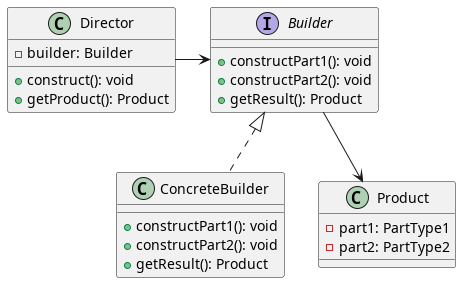

## Padrão Builder

**O padrão Builder é um padrão de projeto criacional que permite a você construir objetos complexos passo a passo.** O padrão permite que você produza diferentes tipos e representações de um objeto usando o mesmo código de construção.

## Quando usar

Use o padrão Builder quando:

* Você precisa construir objetos complexos com muitas partes interdependentes.
* A ordem em que as partes são construídas é importante.
* Você deseja criar diferentes representações de um objeto usando o mesmo código de construção.
* Você deseja separar a lógica de construção da interface do objeto.

## Exemplo de Uso

Um exemplo comum de uso do Builder é na construção de interfaces gráficas complexas, onde você precisa criar vários elementos com diferentes propriedades e organizá-los em uma hierarquia específica.

### Classes e seus papeis

* **Builder**: Define a interface para construir partes do objeto.
* **Concrete Builder**: Implementa a interface Builder para construir partes específicas do objeto.
* **Director**: Controla a ordem em que as partes do objeto são construídas.
* **Product**: Representa o objeto final que está sendo construído.

## Vantagens

* O padrão Builder torna o código de construção de objetos mais fácil de ler e entender.
* Permite a criação de diferentes representações de um objeto usando o mesmo código de construção.
* Separa a lógica de construção da interface do objeto.
* Facilita a criação de objetos complexos com muitas partes interdependentes.

## Desvantagens

* O padrão Builder pode ser um pouco mais complexo de implementar do que outros padrões de projeto.
* Pode ser difícil determinar quais partes do objeto devem ser construídas pelo Builder e quais devem ser construídas diretamente pelo cliente.

## Diagrama do Builder

