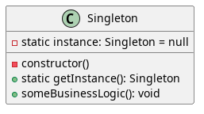

# Singleton

O padrão Singleton é um padrão de projeto criacional que garante que uma classe tenha apenas uma instância e fornece um ponto de acesso global a essa instância. Esse padrão envolve uma classe única que é responsável por criar sua própria instância e garantir que nenhuma outra instância seja criada. Ele também fornece um método estático que permite aos clientes acessar a instância única.

## Quando usar

Use o padrão Singleton quando:

- Você precisa garantir que uma classe tenha apenas uma instância e fornecer um ponto de acesso global a essa instância.
- A única instância da classe deve ser extensível por subclasses e os clientes devem ser capazes de usar uma instância estendida sem modificar seu código.
- Você deseja controlar o acesso à instância única, garantindo que nenhum outro objeto possa instanciá-la diretamente.

## Exemplo de Uso

Um exemplo comum de uso do Singleton é em uma aplicação que precisa de uma única instância de um gerenciador de logs, um pool de conexões de banco de dados ou um objeto de configuração global.

## Diagrama do Singleton

